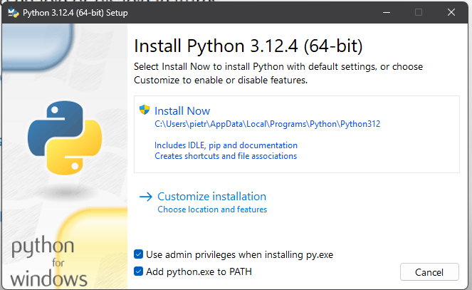

This used "Kian Brose" video as a base. [https://www.youtube.com/watch?v=YRAIUA-Oc1Y]

This is a tutorial for installing and using the code, shall be used in your own risk.

First install python:

[https://www.python.org/downloads/]

Mark the "add python.exe to PATH"

Open CMD with ADM privilege to instal with PIP command, list below:
[can update python pip if wanted, but not required, command will be: python.exe -m pip install --upgrade pip]

pip install pywin32
pip install keyboard
pip install pyautogui
pip install opencv-python

After this, you shall use the rest of the code or just do whatever you want with it.

To use the libraries you installed above:

from pyautogui import *
import pyautogui
import time
import keyboard
import random
import win32api, win32con